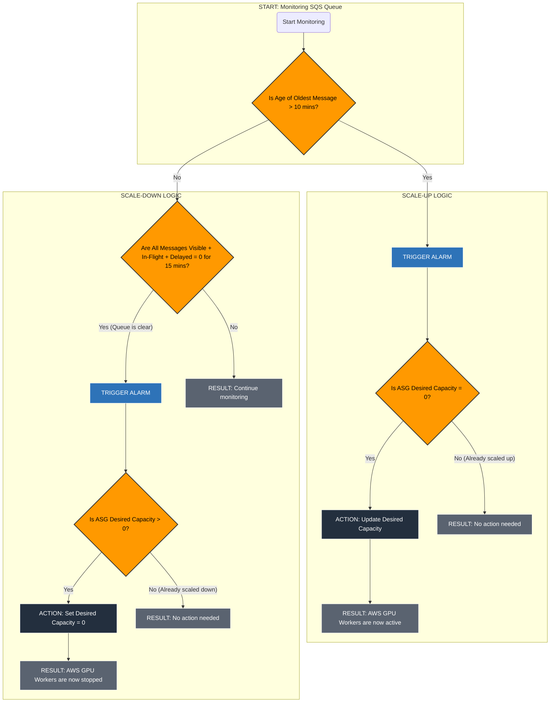

```mermaid
graph TD
    subgraph "START: Monitoring SQS Queue"
        A(Start Monitoring) --> B{Is Age of Oldest Message > 10 mins?};
    end

    subgraph "SCALE-UP LOGIC"
        B -- "Yes" --> C[TRIGGER ALARM];
        C --> D{Is ASG Desired Capacity = 0?};
        D -- "Yes" --> E[ACTION: Update Desired Capacity];
        E --> F[RESULT: AWS GPU Workers are now active];
        D -- "No (Already scaled up)" --> G[RESULT: No action needed];
    end

    subgraph "SCALE-DOWN LOGIC"
        B -- "No" --> H{Are All Messages Visible + In-Flight + Delayed = 0 for 15 mins?};
        H -- "Yes (Queue is clear)" --> I[TRIGGER ALARM];
        I --> J{Is ASG Desired Capacity > 0?};
        J -- "Yes" --> K[ACTION: Set Desired Capacity = 0];
        K --> L[RESULT: AWS GPU Workers are now stopped];
        J -- "No (Already scaled down)" --> M[RESULT: No action needed];
        H -- "No" --> N[RESULT: Continue monitoring];
    end

    %% Styling
    classDef decision fill:#FF9900,stroke:#333,stroke-width:2px,color:#000
    classDef action fill:#232F3E,stroke:#fff,stroke-width:1px,color:#fff
    classDef state fill:#2E73B8,stroke:#fff,stroke-width:1px,color:#fff
    classDef terminal fill:#5A6370,stroke:#fff,stroke-width:1px,color:#fff

    class B,D,H,J decision
    class C,I state
    class E,K action
    class F,G,L,M,N terminal
```
