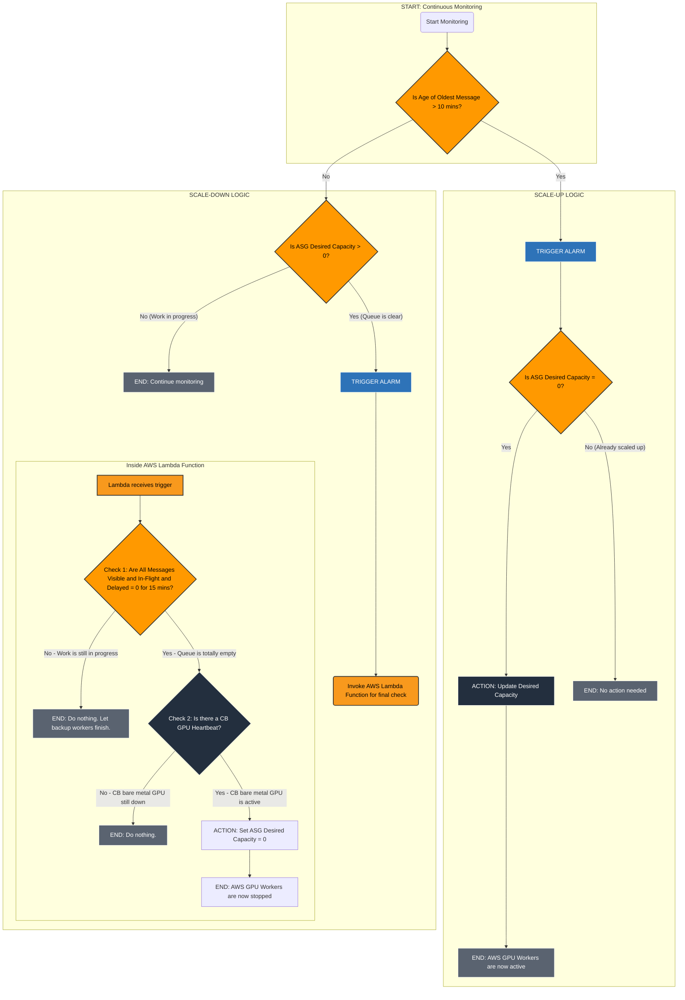

```mermaid
graph TD
    subgraph "START: Continuous Monitoring"
        A(Start Monitoring) --> B{Is Age of Oldest Message > 10 mins?};
    end

    %% --- SCALE-UP PATH (Restored to original detailed logic) ---
    subgraph "SCALE-UP LOGIC"
        B -- "Yes" --> C[TRIGGER ALARM];
        C --> D{Is ASG Desired Capacity = 0?};
        D -- "Yes" --> E[ACTION: Update Desired Capacity];
        E --> F[END: AWS GPU Workers are now active];
        D -- "No (Already scaled up)" --> G[END: No action needed];
    end

    %% --- SCALE-DOWN PATH (Intelligent Logic) ---
    subgraph "SCALE-DOWN LOGIC"
        direction TB
        B -- "No" --> H{Is ASG Desired Capacity > 0?};
        H -- "No (Work in progress)" --> I[END: Continue monitoring];
        H -- "Yes (Queue is clear)" --> J[TRIGGER ALARM];
        J --> K(Invoke AWS Lambda Function for final check);

        subgraph "Inside AWS Lambda Function"
            direction TB
            L[Lambda receives trigger] --> M{Check 1: Are All Messages Visible and In-Flight and Delayed = 0 for 15 mins?};
            M -- "No - Work is still in progress" --> N[END: Do nothing. Let backup workers finish.];
            
            M -- "Yes - Queue is totally empty" --> O{Check 2: Is there a CB GPU Heartbeat?};
            O -- "No - CB bare metal GPU still down" --> P[END: Do nothing.];
            
            O -- "Yes - CB bare metal GPU is active" --> Q[ACTION: Set ASG Desired Capacity = 0];
            Q --> R[END: AWS GPU Workers are now stopped];
        end
    end

    %% Styling
    classDef decision fill:#FF9900,stroke:#333,stroke-width:2px,color:#000;
    classDef action fill:#232F3E,stroke:#fff,stroke-width:1px,color:#fff;
    classDef lambda fill:#F8991D,stroke:#333,stroke-width:2px,color:#000;
    classDef state fill:#2E73B8,stroke:#fff,stroke-width:1px,color:#fff;
    classDef nodeend fill:#5A6370,stroke:#fff,stroke-width:1px,color:#fff;

    class B,D,H,M decision;
    class E,O action;
    class C,J state;
    class K,L lambda;
    class F,G,I,N,P nodeend;

```